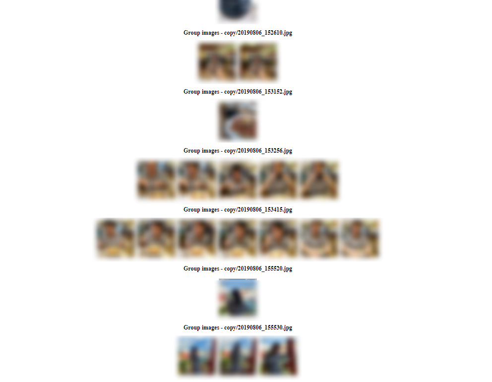

# Image Duplication Deleter

This project is a React-based web application for managing and deleting duplicate images. The application allows users to select images or a local directory, group duplicate images using the VGG16 model, and delete selected images.




## Installation
```bash
$ git clone https://github.com/lokhei/photo_dedup.git
$ cd photo_dedup
```
## Local Setup
Install dependencies
```bash
$ python3 -m venv venv # create venv
$ source venv/bin/activate  # On Windows, use `venv\Scripts\activate`
$ pip install -r requirements.txt
$ cd ui
$ npm install
```
Run the backend server
```bash
$ python app.py
```

Run the frontend server
```bash
$ cd ui
$ npm start
```
Access the website on `http://localhost:3000`
